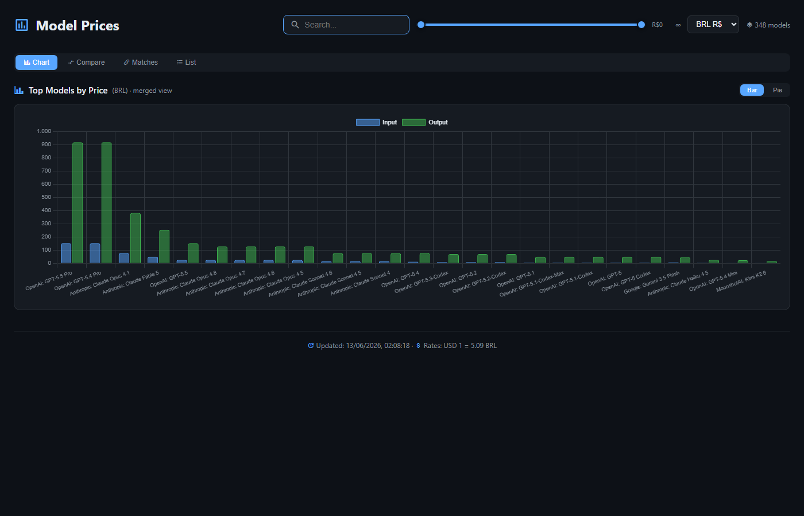
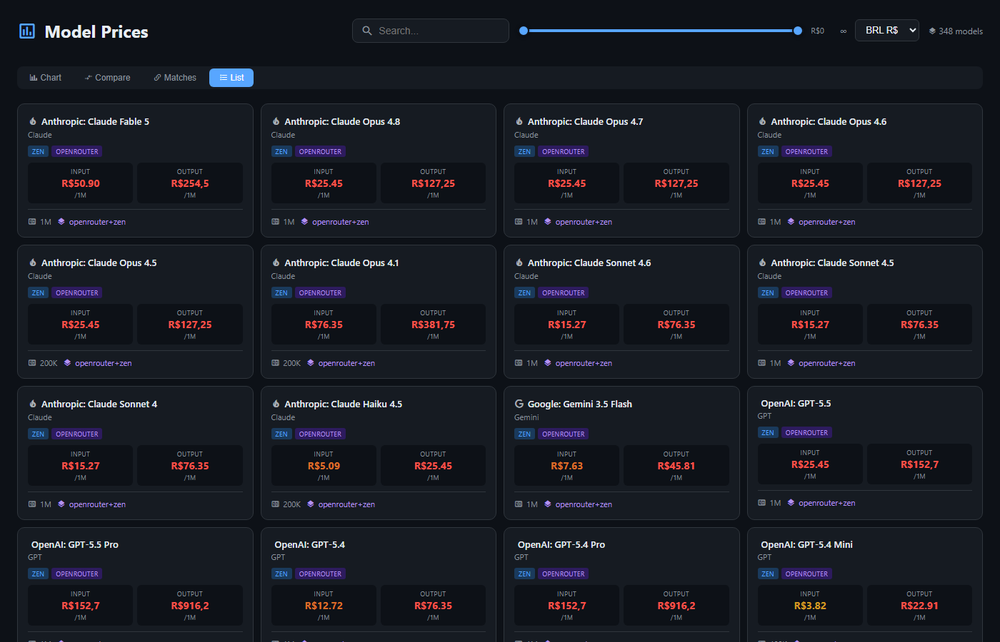
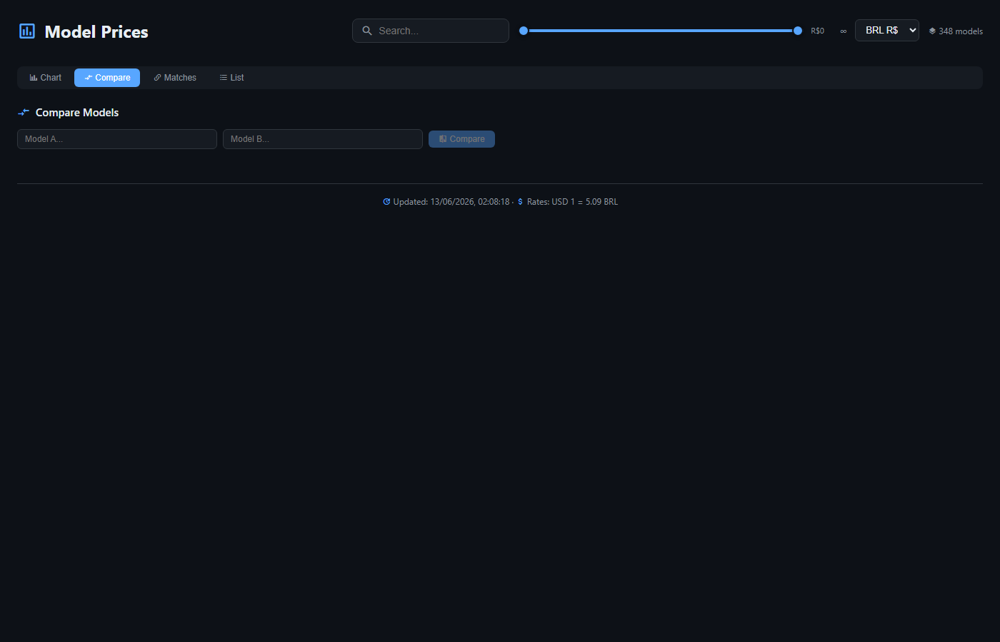

# Model Prices

Visualizador de preços de modelos de IA com suporte a múltiplos provedores e moedas.

## Demonstração

| Chart | Lista |
|-------|-------|
|  |  |

| Comparação |
|------------|
|  |

## Estrutura do Projeto

```
├── .gitignore
├── package.json
├── server.js
├── commits/
│   └── commit-*.md
├── node_modules/
└── public/
    ├── index.html
    ├── css/
    │   └── style.css
    ├── js/
    │   └── script.js
    └── screenshots/
        ├── chart.png
        ├── list.png
        └── compare.png
```

## Scripts

| Script | Descrição |
|--------|-----------|
| `server.js` | Servidor Express que serve a aplicação e as APIs de dados |

## Endpoints da API

- `GET /api/prices` - Retorna os preços dos modelos
- `GET /api/rates` - Retorna as taxas de câmbio
